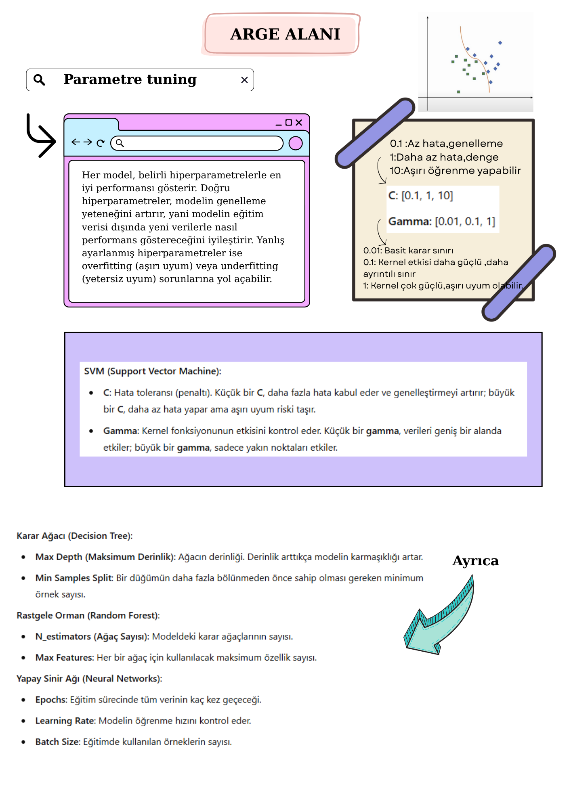
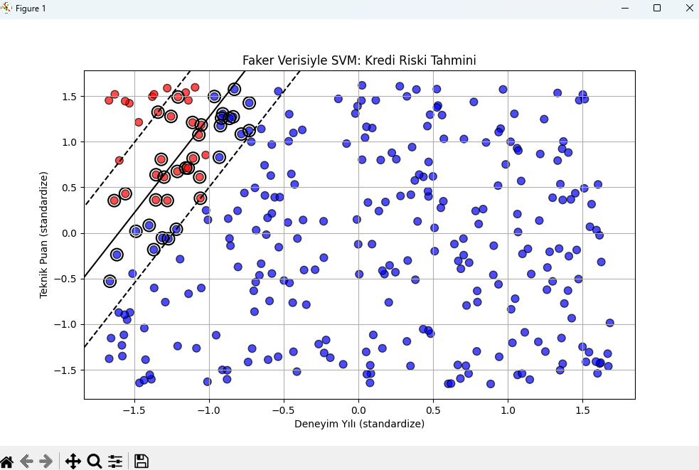
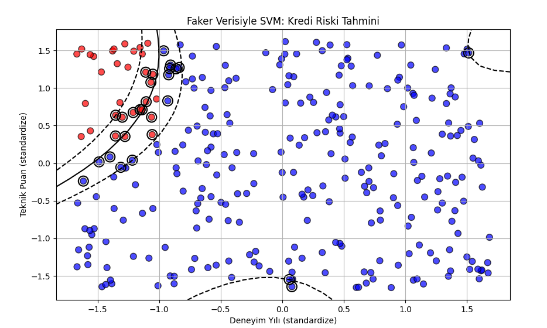
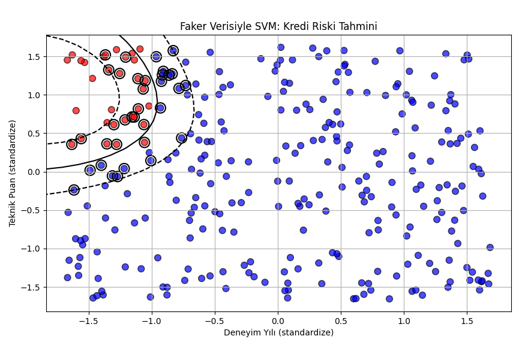
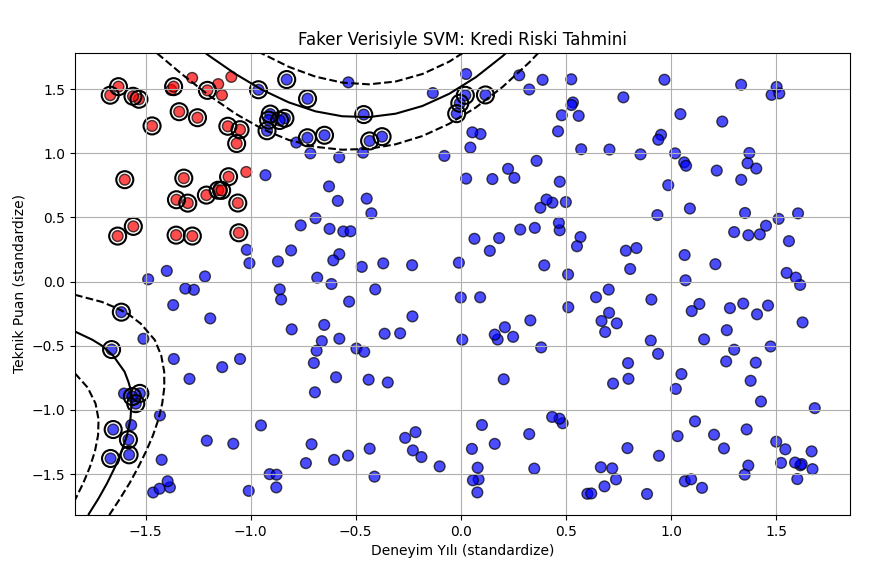

# 💼 SVM ile Aday Başarı Tahmini

Bu projede, **Faker** kütüphanesi ile oluşturulan sahte veriler kullanılarak, adayların iş görüşmelerindeki başarı durumları **Support Vector Machine (SVM)** algoritması ile tahmin edilmektedir.

---

## 📊 Kullanılan Özellikler
- **Deneyim yılı** (0–10 yıl arasında)
- **Teknik test puanı** (0–100 arasında)

---

## 🎯 Hedef Değişken (Label)
Adayın başarı durumu:
- `0`: Başarılı aday (işe alındı)
- `1`: Başarısız aday (işe alınmadı)

**Etiketleme Kuralı:**
- Eğer adayın deneyimi **2 yıldan az** ve teknik puanı **60'tan büyükse**, **başarısız** (`1`)
- Aksi halde **başarılı** (`0`)

---

## ⚙️ Kullanılan Kütüphaneler
- `numpy`
- `matplotlib`
- `faker`
- `scikit-learn`

---

## 🔍 Modelleme Süreci
1. Veriler üretildi ve etiketlendi.
2. Veriler `StandardScaler` ile ölçeklendirildi.
3. Eğitim ve test verileri ayrıldı.
4. `SVC` (Support Vector Classifier) modeli eğitildi (`kernel="linear"`).
5. Modelin doğruluğu ve istatistikleri ölçüldü:
   - Accuracy
   - Confusion Matrix
   - Classification Report
6. Tahmin fonksiyonu ile kullanıcıdan gelen veriler sınıflandırıldı.
7. Karar sınırları grafikle gösterildi.

---

## 📈 Çıktılar
- **Doğruluk Oranı (Accuracy)**
- **Karışıklık Matrisi (Confusion Matrix)**
- **Precision, Recall, F1-score**
- **Sınıflandırma Karar Sınırı Grafiği**

---

## 🚀 Nasıl Çalıştırılır?
```bash
pip install numpy matplotlib faker scikit-learn
python svm_aday_tahmin.py
```

---

## 🔮 Örnek Tahminler
```python
predict(1.2, 25)  # Başarılı aday
predict(1.5, 70)  # Başarısız aday
```

---

## 📌 Geliştirme Fikirleri
- `kernel='rbf'`, `kernel='poly'` gibi seçeneklerle doğrusal olmayan modeller denenebilir.
- `GridSearchCV` ile parametreler optimize edilerek daha iyi sonuçlar elde edilebilir.
- Yeni özellikler eklenerek modelin başarımı test edilebilir (örneğin: iletişim becerisi, eğitim durumu vs).

---

> Bu proje, makine öğrenmesini temel düzeyde öğretmek ve veriyle karar verme sürecini görselleştirmek amacıyla hazırlanmıştır.


